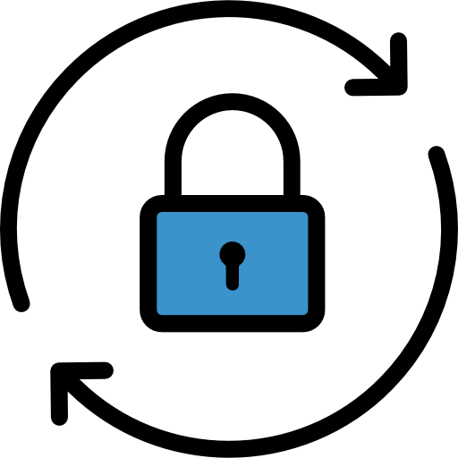
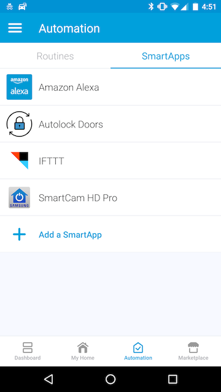
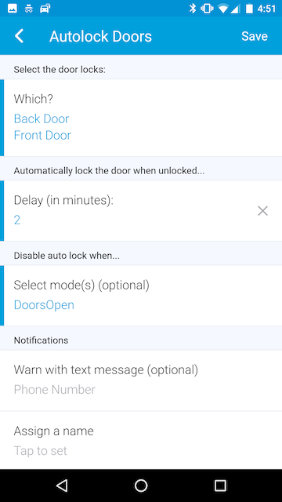

# Autolock Doors

This SmartThings SmartApp enables you to set up your doors to automatically lock
after a period of being unlocked. It has an optional setting to disable locking
in a specific mode.

For example, create a "Party" mode for your "Home" Location, and select this mode
in the app. Now, when your "Home" Location is in "Party" mode, doors will not
automatically lock.

## Alexa Integration

Alexa will not control any devices or routines which directly interface with locks.

To integrate with Alexa, create a Routine in the SmartThings app which changes the Mode to one of your disabled modes, and another Routine to change your mode back.

For example:

1. Set up Autolock Doors to auto lock your "Front Door" and "Back Door", disabled in DoorsOpen Mode.
2. Create a Routine called "Guests Arriving" which sets the Mode to "DoorsOpen"
3. Create a second Routine called "Guests Leaving" which sets the Mode to "Home"
3. Refresh the Alexa SmartApp to pick up the new routines.
4. Say "Alexa, turn on Guests Arriving"
5. Now, when you unlock your door, it will not automatically lock.
6. Say "Alexa, turn on Guests Leaving" and lock your door.
7. Now, when you unlock your door, it will auto lock after your configured delay.

## Screen Shots

License MIT,

Inspired by my own desire to have locking doors but not all the time.

Code adapted from https://community.smartthings.com/t/auto-lock-door-only/82418

Icon made by [Gregor Cresnar](https://www.flaticon.com/authors/gregor-cresnar) from [www.flaticon.com](https://www.flaticon.com/) is licensed by [CC 3.0 BY](http://creativecommons.org/licenses/by/3.0/)
